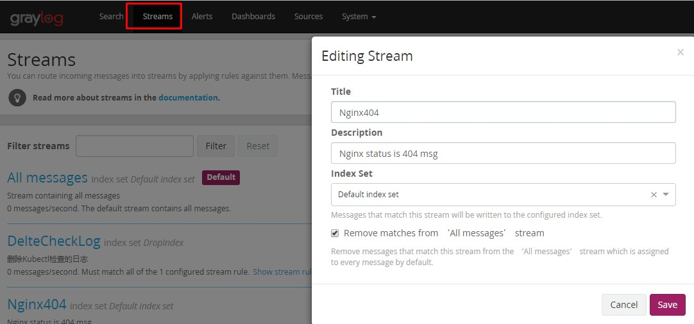
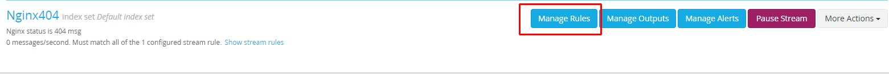
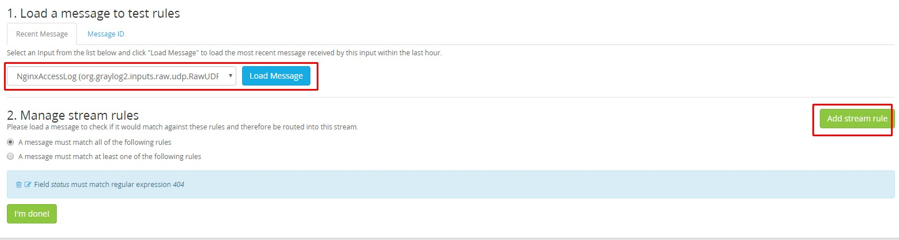
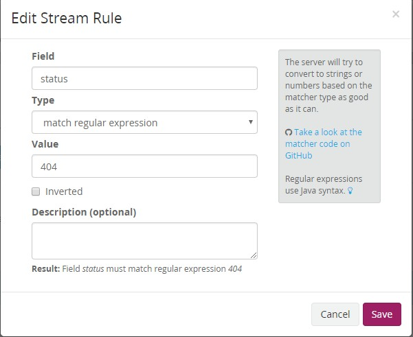
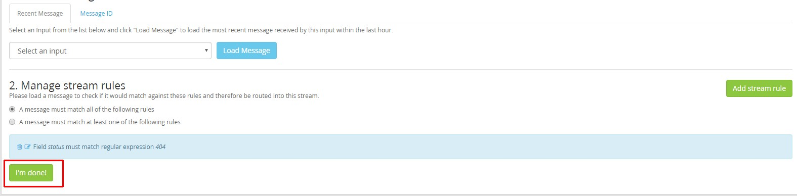
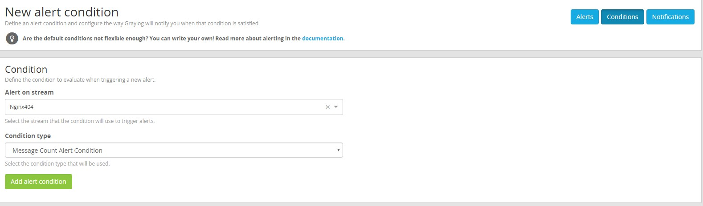
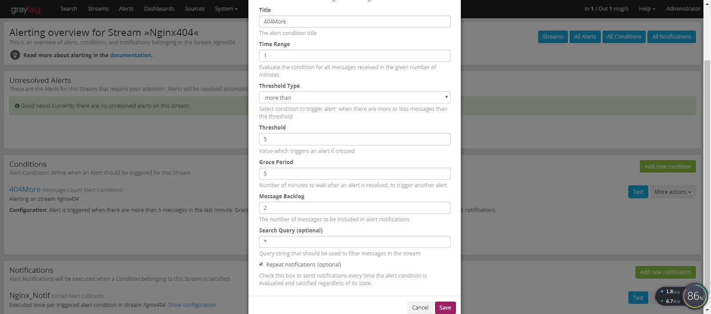
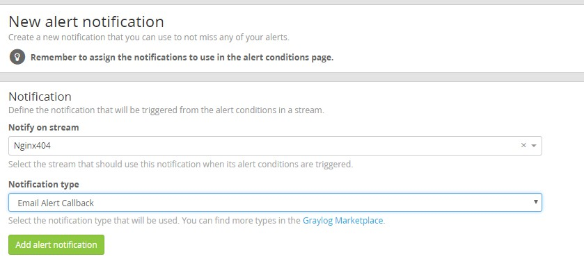
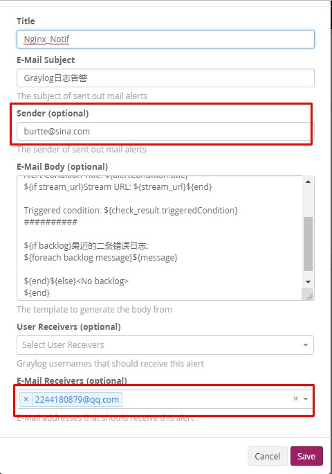
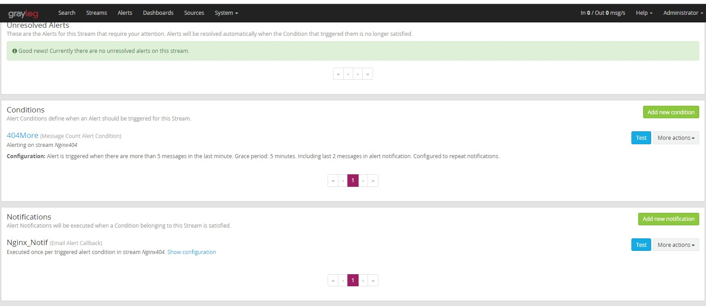

# GrayLog基于Stream告警设置

官方建议基于Stream来实现告警，我们可以定义一些规则，比如Nginx日志中的status字段为500时，就放入指定Stream中，这样匹配起来效果最好。

## 创建Stream

如下图所示操作

完成的，返回列表页,找到刚才创建的规则，并点击"`Manage Rules`"

增加路由规则

下面示例增加匹配`404`的规则

Type可选项有多个，具体请查看官方文档。

这里的意义是，如果接收到的消息的`status`列的值匹配正则`404`,则会进入该Stream。

## 创建AlertCondition--告警条件

回到`Stream`列表页，点击`Manager Alerts`

创建告警规则

## 创建Notifications--告警方式

`Sender`的值需要同配置文件的发送邮件地址一样
`E-Mail Receviers`是接收人，直接在输入框输入后添加

相关内容填好保存起来

下面是都配置好的截图

可以点击`TEST`来进行测试配置是否正确