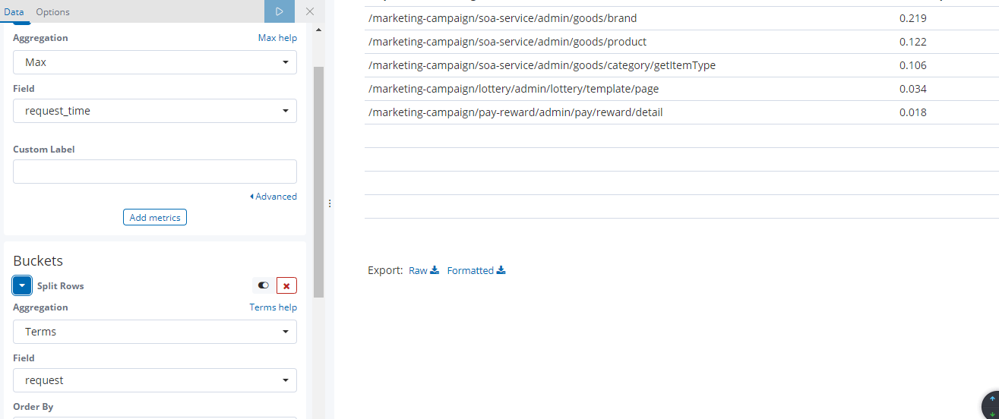
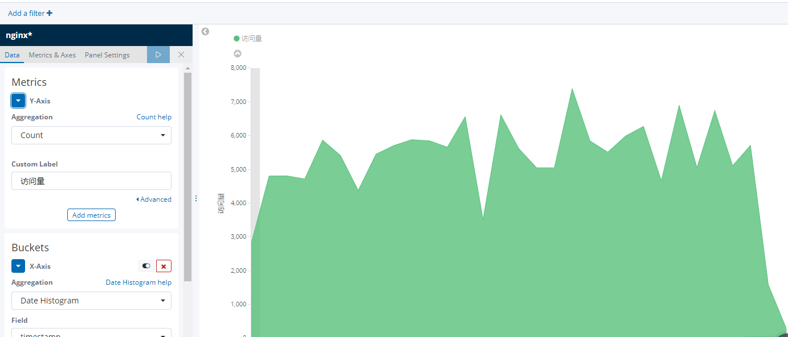

# Kibana使用Graylog作为数据源展示

Kibana的唯一要求就是需要`Elasticsearch`做为数据源的输入，并且需要同`Elastcsearch`相同版本，不然不会兼容。`Graylog`的搜索实现也是`Elasticsearch`,考虑到`Graylog`的大屏展示上并没有`Kibana`美观，所以，如果需要大屏展示时，`Kibana`还是有用武之地的。

## 安装

1. 准备`YAML`

    ```yaml
    kibana:
    # OSS是开源版本，Elasticsearch也需要OSS版本
    image: docker.elastic.co/kibana/kibana-oss:6.6.1
    net: host
    restart: always
    container_name: kibana
    environment:
        ELASTICSEARCH_URL: http://128.0.255.10:9200
    ```

2. 启动服务

    ```bash
    docker-compose up -d
    ```

## 简单大屏样式

- 查看最费时的`URL`。这里要注意的是`request_time`类型是`number`类型

    

- PV统计
  
    