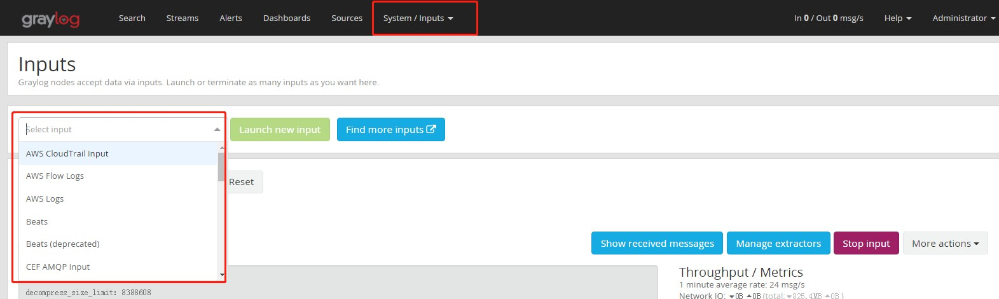

# Graylog配合Rsyslog收集Linux操作系统日志

## Graylog设置

增加一个`Raw/Plaintext UDP`的`Input`即可


## Linux主机端配置

编辑`/etc/rsyslog.conf`文件，只需要加入一行即可

```bash
# CentOS 7
*.*    @graylog.siss.io:5555;RSYSLOG_SyslogProtocol23Format

# CentOS7以下的版本，还需要定义一个Rsyslog的Temlate
$template GRAYLOGRFC5424,"<%PRI%>%PROTOCOL-VERSION% %TIMESTAMP:::date-rfc3339% %HOSTNAME% %APP-NAME% %PROCID% %MSGID% %STRUCTURED-DATA% %msg%\n"
*.*    @graylog.siss.io:5555;GRAYLOGRFC5424

# CentOS6/7  过滤某些消息不发送至远端日志系统
:msg, contains, "oneadmin"  ~    #过滤掉包含oneadmin的日志。过滤多个，多行即可。过滤的是不会被发送至远程
```

以上内容添加完毕后，重启`rsyslog服务`

```bash
systemctl restart rsyslog
```