# Graylog Nginx访问日志收集

## Nginx端配置

因为`NGINX`的`access_log`语法是支持发送至远端的`syslog`的，我们就是利用这一特性来实现。既然可以收集至`Graylog`,我们的目标是可以对访问日志的列进行检索。

 修改`nginx.conf`文件，增加一个`log_format`，将日志格式转化成`JSON`。

```conf
# nginx.conf
...
http {
    ...
    log_format json  '{"timestamp": "$time_iso8601", '
                     '"version": "1.1",'
                     '"source": "nginx",'
                     '"level": "6",'
                     '"remote_addr": "$remote_addr", '
                     '"body_bytes_sent": $body_bytes_sent, '
                     '"request_time": $request_time, '
                     '"response_status": $status, '
                     '"request": "$request", '
                     '"request_time": "$request_time",'
                     '"request_method": "$request_method", '
                     '"host": "$host",'
                     '"upstream_response_time": "$upstream_response_time",'
                     '"upstream_addr": "$upstream_addr",'
                     '"http_x_forwarded_for": "$http_x_forwarded_for",'
                     '"http_referrer": "$http_referer", '
                     '"message": "$scheme://$host$request_uri $status $request_time",'
                     '"http_user_agent": "$http_user_agent" }';

    access_log syslog:server=172.16.18.11:5555 json;
    ...
}
```

## Graylog端设置

1. 进入管理端，创建一个类型为`Raw/Plaintext UDP`的`Input`，输入名字，同时勾选`Global`,其他保持默认。
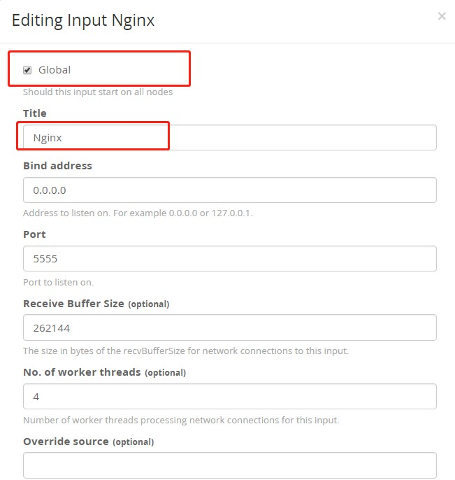

当Input起来之后，访问Nginx，就会将访问日志发送过来了。但是，发送过来的日志内容是非序列化的，是原始字符串，而且`NGINX`还会加上它的标识，原始消息如下:
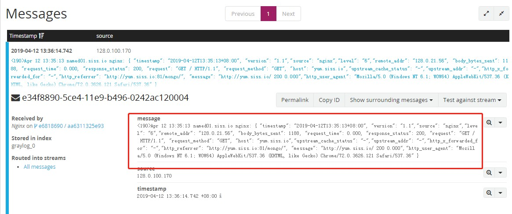
2. 虽然日志发送过来，但是是非序列化的，我们定义的`json`格式并不是真正的`json`内容。接下来就要针对原始内容做一点处理。`Graylog`引入了`extractor`功能，就是用来对输入的消息做些简单处理。在`input`列表页里面，再增加`extractor`。
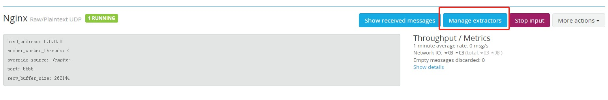
我们分析原始字符串，发现我们需要的`JSON`字符串是在`nginx:`后面的。而前面是`NGINX`添加的`NGINX`所在的主机名以及它自己的进程名称。所以第一步，我们使用`extractor`的`split&Index`功能，将`JSON`字符串提取出来。

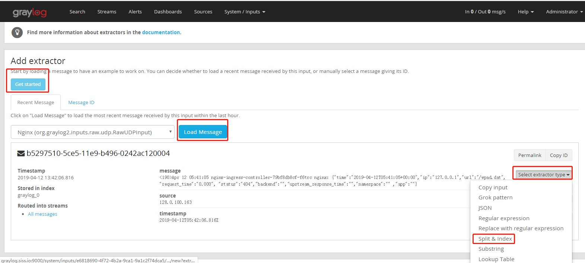
根据`nginx:`分割
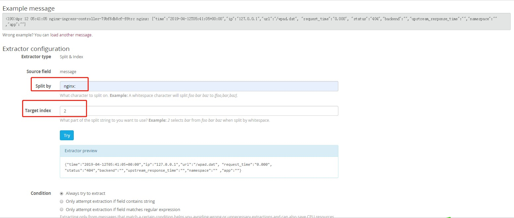
保存的字符段名仍为`message`,并且设置为`cut`，不需要保留原消息，以于节省磁盘空间。
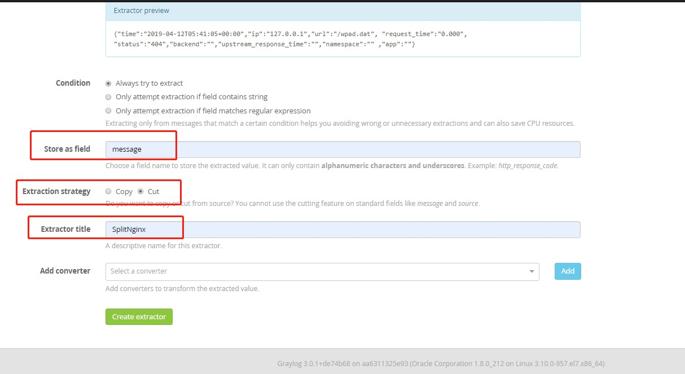
再回到搜索页面，发现日志现在是`JSON`格式的，不过仍然是原始的`JSON`字符串。
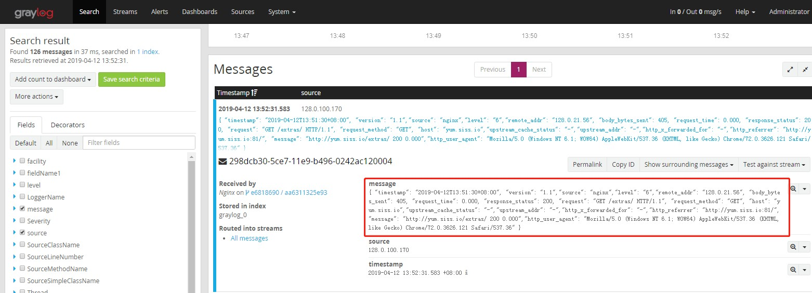
4. 重复刚才的步骤，再增加一个`extractor`，这次类型选择`json`
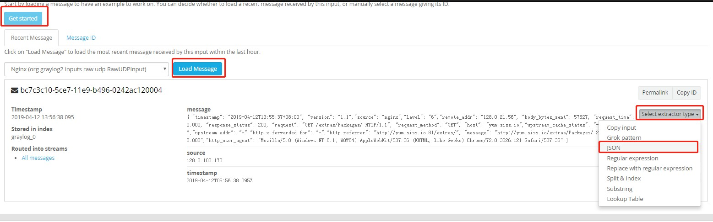
选择始终转换，类型也为`cut`，并命名
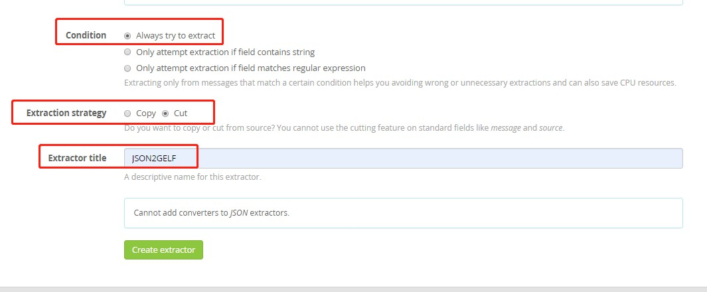
二个都创建好的截图
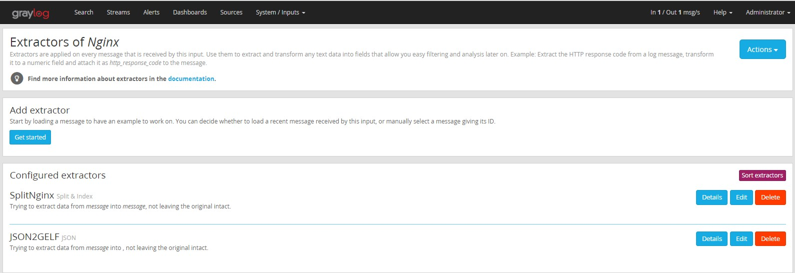
5. 完成，回到`search`页，你会发现`NGINX`的访问日志字段现在都可以作为检索列出现了。
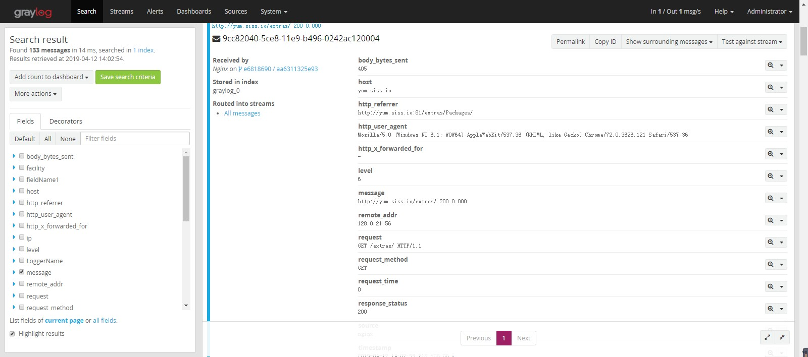